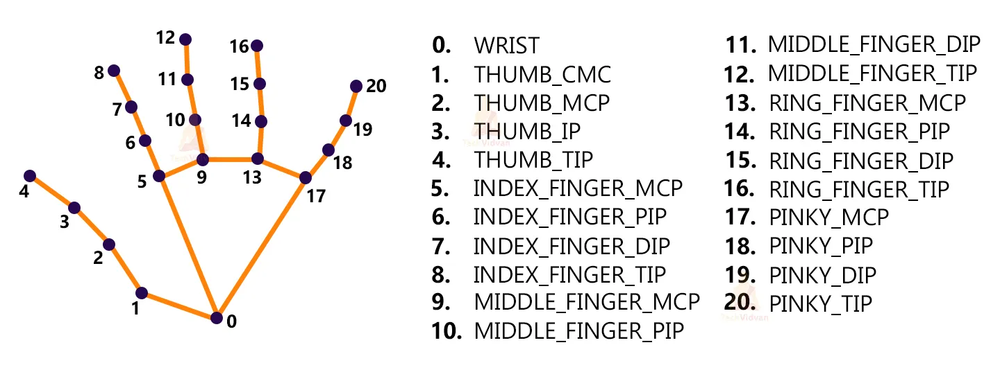

To run this website, first [install Django](https://docs.djangoproject.com/en/3.2/topics/install/#installing-official-release):

```
python -m pip install -r requirements.txt
```

*(Note: You MUST use python 3! I had multiple versions on my computer, so I had to replace `python` with `python3`. In certain cases, the python command may be named `py`. It will probably depend on your exact setup.)*

After the modules have been installed,
you can configure the project using these commands:

```
python manage.py migrate
python manage.py createsuperuser
```

Follow the prompts when given.

# Run the site
Once you have Django installed, open a terminal in this directory and run the following command:
```
python manage.py runserver
```

That will start the local server. Once that command is running, you will be able to view the site at http://localhost:8000/

(When you do this, your terminal is acting like a web server, and your browser is accessing that local server.)

# Sign in to the admin panel
Once the server is running, visit http://localhost:8000/admin to view the admin panel.
Sign in with the username `test` and password `test`. (You can also [create a new account](https://docs.djangoproject.com/en/3.2/intro/tutorial02/#creating-an-admin-user) from the terminal.)

# Updating the data models
If you want to change the data models which appear in the admin panel, edit them in `attendanceapp/models.py`. Then run the following two commands in order:
```
python manage.py makemigrations attendanceapp
python manage.py migrate
```

**Not appearing?** If you create any new models, you will need to update `attendanceapp/admin.py` to make them appear in the admin panel.
# Interaction branch (Hand gesture recognition)

## How to install?
We will be creating a local environment under the project directory, either using `venv` or `conda`. Since there are more than one branches in this project, we will have to switch from environment to environment when checking out different branches. So in this tutorial, we have avoided using generic name for our local environment, such as `env/` or `venv/`; please use `env_interaction/`.

### Using pip
Make sure you are *not* using the pip within conda, otherwise you might encounter an [SSLError](https://stackoverflow.com/questions/45954528/pip-is-configured-with-locations-that-require-tls-ssl-however-the-ssl-module-in).

For Windows:
```powershell
python -m venv .\env_interaction             # create environment
.\env_interaction\Scripts\activate           # activate environment
python -m pip install -r requirements.txt    # install dependencies
```

For macOS/Unix:
```bash
python -m venv ./env_interaction            # create environment
source ./env_interaction/bin/activate       # activate environment
python -m pip install -r requirements.txt   # install dependencies
```

More about pip: https://packaging.python.org/en/latest/guides/installing-using-pip-and-virtual-environments/.

### Using conda
For Windows:
```powershell
(gcm conda.exe).Path   # you should see something, meaning that conda is activated
conda env create --prefix .\env_interaction --file environment.yml # create environment
conda activate .\env_interaction                                   # activate environment
```

For macOS/Unix:
```bash
which conda     # you should see something, meaning that conda is activated
conda env create --prefix ./env_interaction --file environment.yml # create environment
conda activate ./env_interaction                                   # activate environment
```

More about conda: https://docs.conda.io/projects/conda/en/latest/user-guide/tasks/manage-environments.html

## How to use?

The face_images file contains images the app will try to recognize. It contains a placeholder picture of Barack Obama. Add a picture of yourself to the face_images file and name it to your name.

Make sure a camera is connected to the computer, then run the following command:
```bash
python recognition.py
```

Currently, only five gestures are supported:
- One (index finger up)
- Two (index finger and middle finger up)
- Three (index finger, middle finger and ring finger up)
- Thumbs up
- Thumbs down

## How to train?
This is still under development. For now, we have a very simple model (Support Vector Machine) that trains on ~300 labeled landmarks; see [`landmarked.csv`](data/landmarked.csv). The trained model is saved as [`model.pkl`](model.pkl). To (re)train the model, run the following command:
```bash
python train.py
```

## What is a landmark?
Landmark, or hand landmark, is a point on the hand that is used for hand gesture recognition. In this project, we use the hand tracking solutions by [MediaPipe](https://google.github.io/mediapipe/solutions/hands) to detect the 21 landmarks. Then we train our own model to classify the hand gesture using the (x, y, z) coordinates of the landmarks. Below is a figure showing the indices of the landmarks, which are stored in [`landmark-index.json`](landmark-index.json).
 Credit: [MediaPipe](https://google.github.io/mediapipe/solutions/hands)
